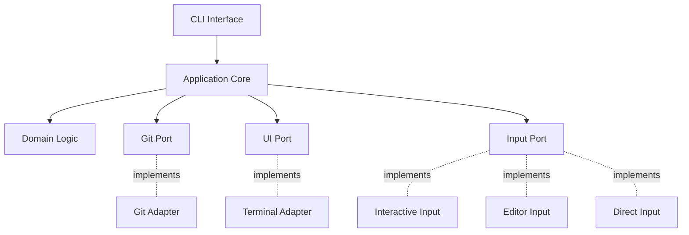

# Grit

> A modern, interactive Git commit message tool written in Rust

Grit is a command-line tool that helps developers write better Git commit messages by providing an interactive interface with support for Conventional Commits format. Built with Rust for performance and reliability.

## Features

- 🎯 **Interactive Mode** - Step-by-step guided commit message creation
- ✏️ **Editor Mode** - Open your favorite text editor with a pre-filled template
- ⚡ **Direct Mode** - Quick commits from command line arguments
- 🎨 **Custom Syntax** - Domain-specific language (DSL) for commit message templates
- 📝 **Conventional Commits** - Built-in support for the Conventional Commits specification
- 🔄 **Git Integration** - Seamless integration with Git workflow
- 🏗️ **Hexagonal Architecture** - Clean, maintainable, and testable codebase

## Quick Start

### Installation

```bash
# Using the install script (Unix-like systems)
curl -fsSL https://raw.githubusercontent.com/tgenericx/commando/main/install.sh | sh

# Using PowerShell (Windows)
iwr -useb https://raw.githubusercontent.com/tgenericx/commando/main/install.ps1 | iex

# Building from source
cargo install commando
```

### Basic Usage

```bash
# Interactive mode (default)
commando

# Editor mode
commando

# Direct mode
commando -m "feat: add new feature"

# With scope
commando -m "fix(api): resolve authentication issue"
```

## Project Structure

```
commando/
├── src/
│   ├── adapters/       # External interfaces (Git, UI)
│   ├── compiler/       # DSL lexer, parser, and AST
│   ├── domain/         # Core business logic
│   ├── input/          # Input collection strategies
│   ├── ports/          # Interface definitions (traits)
│   ├── app.rs          # Application orchestration
│   ├── cli.rs          # CLI argument parsing
│   └── main.rs         # Entry point
├── docs/               # Comprehensive documentation
└── Cargo.toml          # Project configuration
```

## Documentation

- [Architecture](docs/ARCHITECTURE.md) - System design and patterns
- [Requirements](docs/REQUIREMENTS.md) - Functional and technical requirements
- [Flow Diagrams](docs/FLOW.md) - Process flows and state machines
- [DSL Specification](docs/DSL.md) - Domain-specific language reference
- [Development Guide](docs/DEVELOPMENT.md) - Contributing and development setup
- [API Reference](docs/API.md) - Module and function documentation

## Key Concepts

### Conventional Commits

Grit follows the [Conventional Commits](https://www.conventionalcommits.org/) specification:

```
<type>(<scope>): <subject>

<body>

<footer>
```

**Supported types:**
- `feat` - A new feature
- `fix` - A bug fix
- `docs` - Documentation changes
- `style` - Code style changes (formatting, semicolons, etc.)
- `refactor` - Code refactoring
- `perf` - Performance improvements
- `test` - Adding or updating tests
- `build` - Build system changes
- `ci` - CI configuration changes
- `chore` - Other changes that don't modify src or test files
- `revert` - Reverts a previous commit

### Input Modes

1. **Interactive Mode** - Prompts user through each commit message section
2. **Editor Mode** - Opens configured editor with a template
3. **Direct Mode** - Accepts complete message from command line

## Architecture Highlights

Grit uses **Hexagonal Architecture** (Ports & Adapters):



## Development

```bash
# Clone the repository
git clone https://github.com/tgenericx/commando.git
cd commando

# Build the project
cargo build

# Run tests
cargo test

# Run with logging
RUST_LOG=debug cargo run

# Install locally
cargo install --path .
```

## Contributing

Contributions are welcome! Please read our [Development Guide](docs/DEVELOPMENT.md) for details on:

- Code structure and organization
- Testing practices
- Pull request process
- Code style guidelines

## License

[LICENSE](LICENSE)

## Credits

Built with ❤️ using:
- [Rust](https://www.rust-lang.org/)
- [Clap](https://github.com/clap-rs/clap) - Command line argument parsing

## Related Projects

- [Commitizen](https://github.com/commitizen/cz-cli) - The original commit message tool
- [git-cz](https://github.com/streamich/git-cz) - Commitizen adapter
- [Conventional Commits](https://www.conventionalcommits.org/) - The specification

