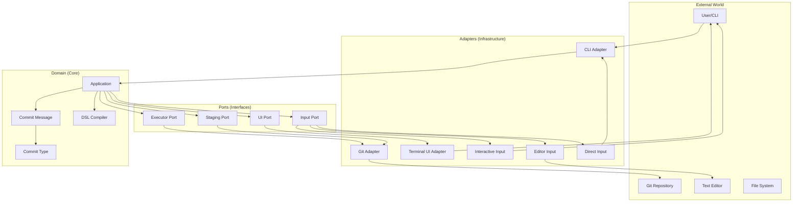
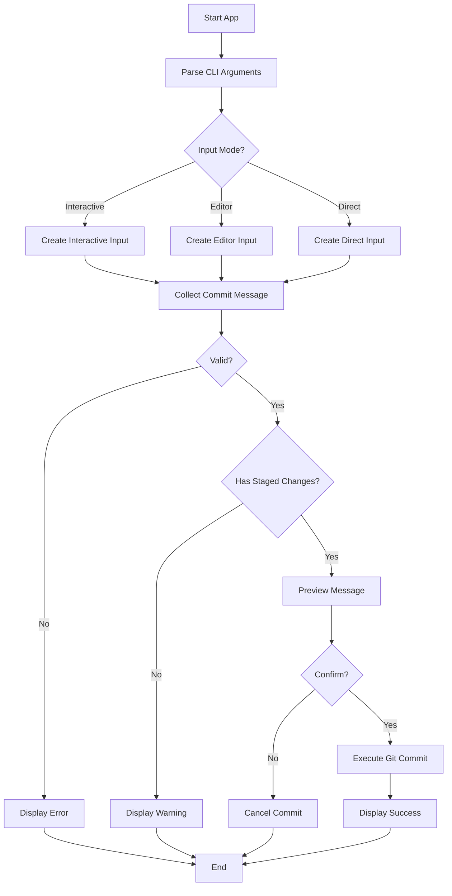
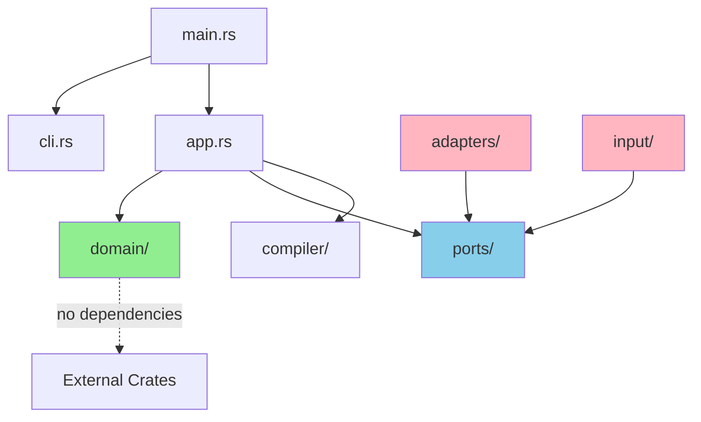
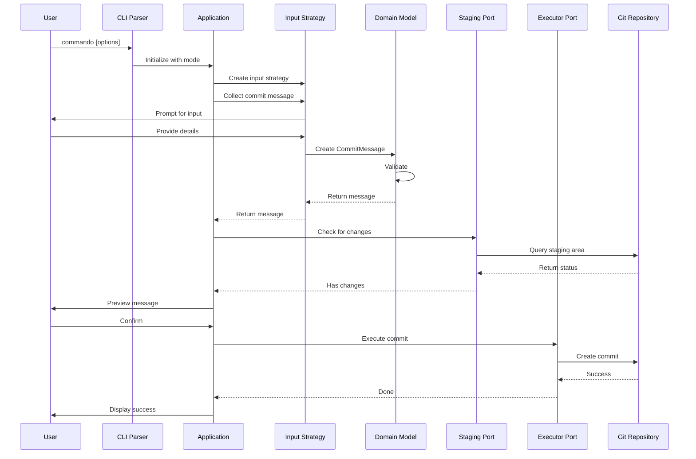
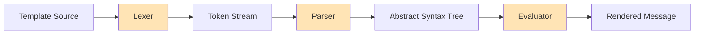
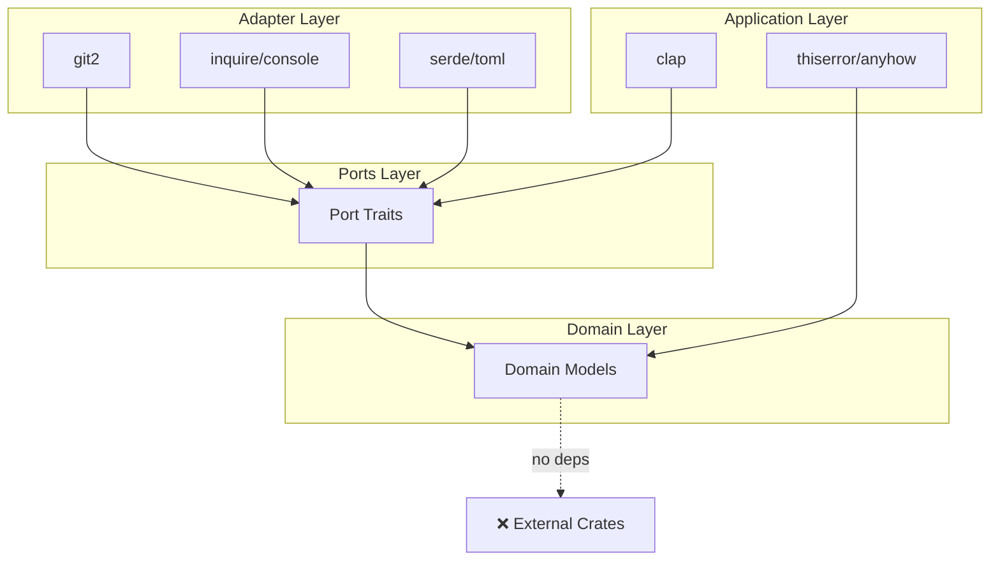

# Architecture

This document describes the architecture, design patterns, and structural decisions of the Commando project.

## Table of Contents

- [Overview](#overview)
- [Architectural Pattern](#architectural-pattern)
- [Layer Descriptions](#layer-descriptions)
- [Module Organization](#module-organization)
- [Design Patterns](#design-patterns)
- [Data Flow](#data-flow)
- [Dependencies](#dependencies)

## Overview

Commando is built using **Hexagonal Architecture** (also known as Ports and Adapters pattern) to achieve:

- **Independence from Frameworks**: Core logic doesn't depend on external libraries
- **Testability**: Business logic can be tested in isolation
- **Flexibility**: Easy to swap implementations (e.g., different UI frameworks)
- **Maintainability**: Clear separation of concerns

## Architectural Pattern

### Hexagonal Architecture



### Layers

1. **Domain Layer** (Core)
   - Pure business logic
   - No external dependencies
   - Contains domain models and rules

2. **Ports Layer** (Interfaces)
   - Defines contracts (traits)
   - No implementation details
   - Connects domain to adapters

3. **Adapters Layer** (Infrastructure)
   - Implements port interfaces
   - Handles external communication
   - Contains framework-specific code

4. **Application Layer**
   - Orchestrates the flow
   - Coordinates between layers
   - Implements use cases

## Layer Descriptions

### Domain Layer

Located in `src/domain/`

#### Purpose
Contains the core business logic and domain models that represent the problem space.

#### Components

**CommitMessage** (`commit_message.rs`)
```rust
pub struct CommitMessage {
    commit_type: CommitType,
    scope: Option<String>,
    subject: String,
    body: Option<String>,
    footer: Option<String>,
    breaking: bool,
}
```

Domain model representing a Git commit message with validation rules.

**CommitType** (`commit_type.rs`)
```rust
pub enum CommitType {
    Feat,
    Fix,
    Docs,
    Style,
    Refactor,
    Perf,
    Test,
    Build,
    CI,
    Chore,
    Revert,
}
```

Enumeration of valid commit types according to Conventional Commits.

**Domain Error** (`error.rs`)
- Custom error types for domain validation
- Ensures type safety and clear error messages

#### Characteristics
- No I/O operations
- No external dependencies
- Pure functions where possible
- Rich domain model with validation

### Ports Layer

Located in `src/ports/`

#### Purpose
Defines interfaces (traits) that domain code uses to interact with the outside world.

#### Components

**Executor Port** (`executor.rs`)
```rust
pub trait Executor {
    fn commit(&self, message: &str) -> Result<()>;
    fn amend(&self, message: &str) -> Result<()>;
}
```

Interface for executing Git commands.

**Staging Port** (`staging.rs`)
```rust
pub trait Staging {
    fn has_staged_changes(&self) -> Result<bool>;
    fn get_diff(&self) -> Result<String>;
}
```

Interface for querying Git staging area.

**UI Port** (`ui.rs`)
```rust
pub trait UI {
    fn display_message(&self, message: &str);
    fn display_error(&self, error: &str);
    fn confirm(&self, prompt: &str) -> Result<bool>;
}
```

Interface for user interaction.

**Input Port** (`input.rs`)
```rust
pub trait Input {
    fn collect(&self) -> Result<CommitMessage>;
}
```

Interface for collecting commit message input from users.

#### Characteristics
- Only trait definitions
- No implementation
- Define behavior contracts
- Enable dependency inversion

### Adapters Layer

Located in `src/adapters/` and `src/input/`

#### Purpose
Implement port interfaces using concrete technologies.

#### Git Adapter (`src/adapters/git/`)

**Executor** (`executor.rs`)
- Implements `Executor` port
- Uses `git2` crate for Git operations
- Handles commit creation and amendment

**Staging** (`staging.rs`)
- Implements `Staging` port
- Queries repository state
- Retrieves diff information

**Error Handling** (`error.rs`)
- Git-specific error types
- Translates git2 errors to domain errors

#### UI Adapter (`src/adapters/ui/`)

**Terminal** (`terminal.rs`)
- Implements `UI` port
- Uses terminal I/O for display
- Handles user interaction in terminal

#### Input Adapters (`src/input/`)

**Interactive** (`interactive/`)
- Step-by-step prompts
- Validates input at each step
- Sections: header, body, footer

**Editor** (`editor/`)
- Opens configured text editor
- Provides pre-filled template
- Parses edited content

**Direct** (`direct/`)
- Accepts command-line arguments
- Minimal user interaction
- Quick commit creation

### Application Layer

Located in `src/app.rs`

#### Purpose
Orchestrates the application flow and coordinates between layers.



#### Responsibilities
- Initialize adapters
- Coordinate input collection
- Validate commit messages
- Execute Git operations
- Handle errors gracefully

## Module Organization

### Directory Structure

```
src/
├── adapters/           # Infrastructure implementations
│   ├── git/           # Git repository adapter
│   │   ├── error.rs   # Git-specific errors
│   │   ├── executor.rs # Command execution
│   │   ├── staging.rs  # Staging area queries
│   │   └── mod.rs     # Module exports
│   ├── ui/            # User interface adapter
│   │   ├── terminal.rs # Terminal-based UI
│   │   └── mod.rs     # Module exports
│   └── mod.rs         # Adapter exports
│
├── compiler/          # DSL compilation
│   ├── ast.rs        # Abstract syntax tree
│   ├── error.rs      # Compilation errors
│   ├── lexer.rs      # Tokenization
│   ├── parser.rs     # Parsing
│   ├── token.rs      # Token definitions
│   └── mod.rs        # Module exports
│
├── domain/           # Core business logic
│   ├── commit_message.rs # Domain model
│   ├── commit_type.rs    # Type enum
│   ├── error.rs          # Domain errors
│   └── mod.rs            # Module exports
│
├── input/            # Input collection strategies
│   ├── direct/       # Direct CLI input
│   │   ├── error.rs
│   │   └── mod.rs
│   ├── editor/       # Editor-based input
│   │   ├── error.rs
│   │   ├── template.rs
│   │   └── mod.rs
│   ├── interactive/  # Interactive prompts
│   │   ├── sections/ # Input sections
│   │   │   ├── body.rs
│   │   │   ├── footer.rs
│   │   │   ├── header.rs
│   │   │   └── mod.rs
│   │   ├── error.rs
│   │   └── mod.rs
│   └── mod.rs        # Input exports
│
├── ports/            # Interface definitions
│   ├── executor.rs   # Git execution interface
│   ├── input.rs      # Input collection interface
│   ├── staging.rs    # Staging query interface
│   ├── ui.rs         # UI interface
│   └── mod.rs        # Port exports
│
├── app.rs            # Application orchestration
├── cli.rs            # CLI parsing
└── main.rs           # Entry point
```

### Module Dependencies



**Dependency Rules:**
1. Domain has no external dependencies
2. Ports depend only on domain
3. Adapters depend on ports and domain
4. Application coordinates all layers

## Design Patterns

### 1. Dependency Inversion Principle

High-level modules (domain) don't depend on low-level modules (adapters). Both depend on abstractions (ports).

```rust
// Port (abstraction)
pub trait Executor {
    fn commit(&self, message: &str) -> Result<()>;
}

// Domain uses the abstraction
pub struct App<E: Executor> {
    executor: E,
}

// Adapter implements the abstraction
pub struct GitExecutor { /* ... */ }

impl Executor for GitExecutor {
    fn commit(&self, message: &str) -> Result<()> {
        // Implementation using git2
    }
}
```

### 2. Strategy Pattern

Different input collection strategies (Interactive, Editor, Direct) implement the same interface.

```rust
pub trait Input {
    fn collect(&self) -> Result<CommitMessage>;
}

// Three different strategies
impl Input for InteractiveInput { /* ... */ }
impl Input for EditorInput { /* ... */ }
impl Input for DirectInput { /* ... */ }
```

### 3. Builder Pattern

Used in domain for constructing complex objects safely.

```rust
pub struct CommitMessageBuilder {
    commit_type: Option<CommitType>,
    scope: Option<String>,
    subject: Option<String>,
    // ...
}

impl CommitMessageBuilder {
    pub fn new() -> Self { /* ... */ }
    pub fn commit_type(mut self, t: CommitType) -> Self { /* ... */ }
    pub fn scope(mut self, s: String) -> Self { /* ... */ }
    pub fn build(self) -> Result<CommitMessage> { /* ... */ }
}
```

### 4. Error Handling Pattern

Custom error types per layer with conversion implementations.

```rust
// Domain error
pub enum DomainError {
    InvalidCommitType,
    EmptySubject,
    // ...
}

// Adapter error
pub enum GitError {
    RepositoryNotFound,
    NoStagedChanges,
    // ...
}

// Convert adapter errors to domain errors
impl From<GitError> for DomainError {
    fn from(error: GitError) -> Self { /* ... */ }
}
```

## Data Flow

### Commit Creation Flow



### Compiler Flow (DSL Processing)



The compiler processes custom template syntax:

1. **Lexer**: Breaks input into tokens
2. **Parser**: Builds AST from tokens
3. **Evaluator**: Evaluates expressions and produces output

## Dependencies

### External Crates

```toml
[dependencies]
# CLI
clap = { version = "4.0", features = ["derive"] }

# Git operations
git2 = "0.18"

# Interactive UI
inquire = "0.6"
console = "0.15"

# Error handling
thiserror = "1.0"
anyhow = "1.0"

# Serialization (for config)
serde = { version = "1.0", features = ["derive"] }
toml = "0.8"
```

### Dependency Boundaries



**Key Principles:**
- Domain layer has zero external dependencies
- Ports depend only on standard library
- Adapters contain all external crate usage
- Clear separation enables testing without dependencies

## Testing Strategy

### Unit Tests

```rust
// Domain tests (no mocks needed)
#[cfg(test)]
mod tests {
    use super::*;
    
    #[test]
    fn test_commit_message_validation() {
        let msg = CommitMessage::new(
            CommitType::Feat,
            Some("api".to_string()),
            "add endpoint".to_string(),
        );
        assert!(msg.is_valid());
    }
}
```

### Integration Tests

```rust
// Test with mock adapters
#[cfg(test)]
mod tests {
    struct MockExecutor {
        commits: RefCell<Vec<String>>,
    }
    
    impl Executor for MockExecutor {
        fn commit(&self, message: &str) -> Result<()> {
            self.commits.borrow_mut().push(message.to_string());
            Ok(())
        }
    }
    
    #[test]
    fn test_app_flow() {
        let executor = MockExecutor::new();
        let app = App::new(executor);
        // Test application flow
    }
}
```

## Benefits of This Architecture

1. **Testability**: Each layer can be tested independently
2. **Maintainability**: Clear separation makes changes easier
3. **Flexibility**: Easy to swap implementations
4. **Scalability**: Add new features without affecting existing code
5. **Clear Boundaries**: Each module has a single responsibility

## Future Considerations

### Potential Extensions

1. **Plugin System**: Use ports to add custom commit types
2. **Multiple Git Backends**: Support other version control systems
3. **Web UI**: Add HTTP adapter without changing core
4. **Configuration Service**: Centralized config management

### Scalability

The architecture supports:
- Adding new input modes (e.g., GUI)
- Supporting additional VCS systems
- Integrating with external services (e.g., issue trackers)
- Custom commit message formats

---

For more details on specific modules, see:
- [Module README files](../src/) in each directory
- [API Documentation](API.md)
- [Flow Diagrams](FLOW.md)

