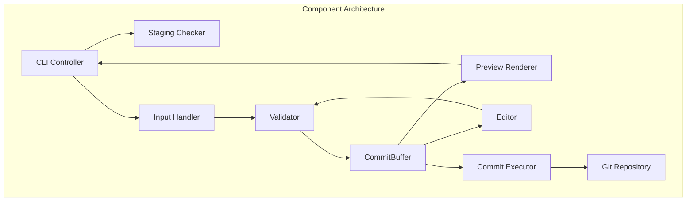
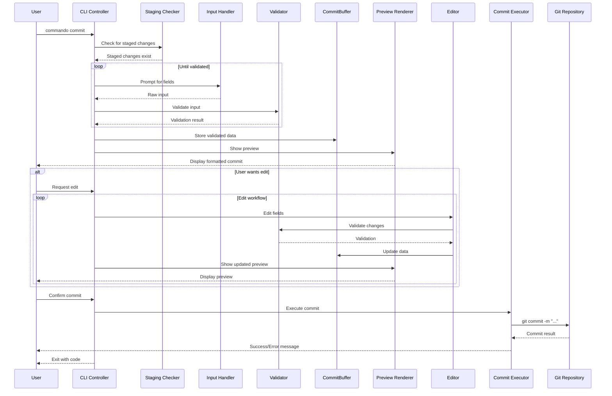
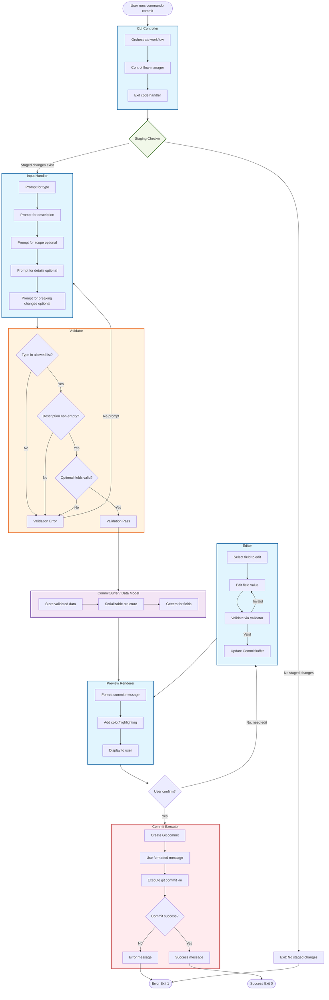
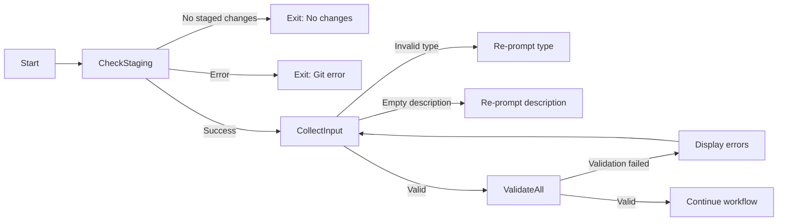
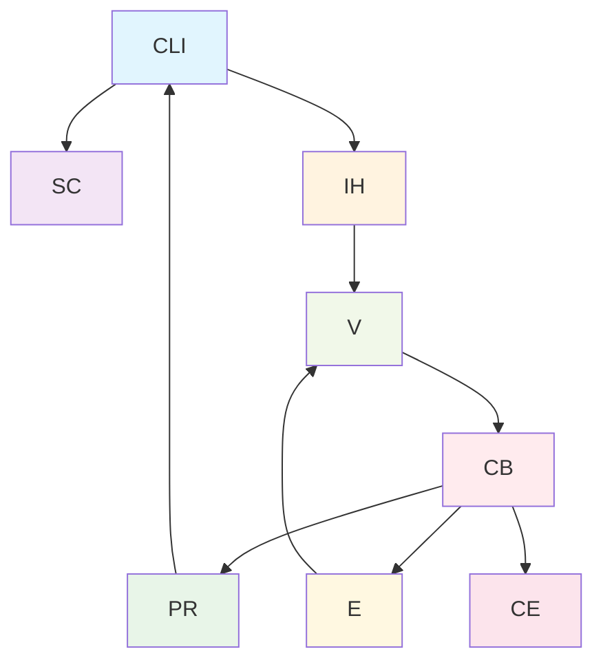

# Architecture

## System Overview

Commando v1 follows a modular, component-based architecture with clear separation of concerns. The system is designed for high cohesion within modules and low coupling between them, making it maintainable, testable, and extensible.

## Components Specifications

### CLI Controller

**Responsibilities**
- Orchestrates the full workflow
- Checks staging first
- Delegates to input, validation, preview, edit, commit

**Inputs**
- Command-line invocation (`commando commit`)
- Optional config / repo path

**Outputs**
- Success/failure messages
- Exit code (0 for success, non-zero for failure)

**Interactions**
- Calls **Staging Checker** first
- If staged → calls Input Handler → Validator → CommitBuffer → Preview Renderer → Editor → Commit Executor
- Handles control flow looping for edit & preview

---

### Staging Checker

**Responsibilities**
- Determine if there are staged changes in the repo
- Provide list of staged files (optional)

**Inputs**
- Git repository path
- Optional flags (e.g., include untracked files?)

**Outputs**
- `Bool` → true if staged changes exist
- `List<String>` → staged files (optional)
- Error if repo not found

**Interactions**
- Returns status to **CLI Controller**
- Prevents commit workflow if no staged changes

---

### Input Handler

**Responsibilities**
- Prompt user for required and optional fields
- Capture input while enforcing type rules

**Inputs**
- Predefined list of allowed types (`feat`, `fix`, …)
- Optional prompts (scope, details, breaking changes)

**Outputs**
- Raw input for each field (to feed Validator / CommitBuffer)

**Interactions**
- Feeds captured data into **Validator**
- Can loop back from **Editor** for re-entry

---

### Validator

**Responsibilities**
- Enforce rules on required and optional fields
- Type must be in allowed list
- Required fields: non-empty, defined
- Optional fields: undefined or non-empty string

**Inputs**
- Raw input from Input Handler / Editor

**Outputs**
- Validation status (`Bool`)
- Errors / messages if invalid

**Interactions**
- Sends feedback to CLI Controller for user correction
- Only validated data stored in **CommitBuffer**

---

### CommitBuffer / Data Model

**Responsibilities**
- Store commit data in structured way
- Provide serialized commit string for preview & commit
- Mutable during edit phase

**Inputs**
- Validated fields from Validator
- Updates from Editor

**Outputs**
- Formatted commit string for preview or commit
- Exposed getters for individual fields (type, description, scope…)

**Interactions**
- Central hub: read/write by Input Handler, Editor, Preview Renderer, Commit Executor

---

### Preview Renderer

**Responsibilities**
- Format commit message for user preview
- Display required + optional fields clearly

**Inputs**
- CommitBuffer (current state)

**Outputs**
- Formatted string to display
- Optional color or highlighting for text-based CLI

**Interactions**
- Invoked by CLI Controller before final confirmation
- Invoked again after editing fields

---

### Editor

**Responsibilities**
- Allow user to edit any field before committing
- Validate changes (via Validator)

**Inputs**
- CommitBuffer
- User selection of field(s) to edit

**Outputs**
- Updated CommitBuffer
- Validation feedback if needed

**Interactions**
- Loops back to **Preview Renderer**
- Only passes back to CLI Controller after user confirms edits

---

### Commit Executor

**Responsibilities**
- Write commit message to Git repo
- Ensure commit respects enforced structure
- Report success/failure

**Inputs**
- CommitBuffer (validated & confirmed)
- Git repository context

**Outputs**
- Success/failure message
- Git commit status code

**Interactions**
- Called once CLI Controller gets final confirmation

---

## Data Flow Architecture

### Primary Flow

### Execution Flow

### Error Flow

## Technical Decisions

### 1. Modular Design Rationale

- **Separation of Concerns:** Each component has single responsibility
- **Testability:** Independent components are easier to test
- **Maintainability:** Changes are isolated to specific modules
- **Extensibility:** New features can be added with minimal impact

### 2. Data Management Strategy

- **Centralized State:** CommitBuffer serves as single source of truth
- **Immutable Operations:** Validation creates new validated objects
- **Serializable Format:** Easy conversion to Git commit format

### 3. Error Handling Approach

- **Fail-Fast:** Validate early and often
- **Recovery-Oriented:** Allow correction without restarting
- **Informative Errors:** Provide actionable error messages

### 4. Performance Considerations

- **Lazy Loading:** Load Git data only when needed
- **Caching:** Cache validation results during edit
- **Optimized Rendering:** Only re-render changed fields

## Dependencies

### External Dependencies

- Git command-line tool (system dependency)
- Terminal/console API
- File system access

### Internal Dependencies

## Scalability Considerations

### Horizontal Scalability

- Component independence allows parallel development
- Clear interfaces enable team collaboration
- Modular testing supports continuous integration

### Vertical Scalability

- Additional commit fields can be added
- New validation rules can be implemented
- Multiple output formats can be supported
- Plugin system for extensibility

## Security Considerations

- Input sanitization for Git commands
- Path traversal prevention
- Permission validation for Git operations
- Secure temporary file handling

## Accessibility Considerations

1. Keyboard navigation support
2. Screen reader compatibility
3. Color contrast requirements
4. Clear focus indicators
