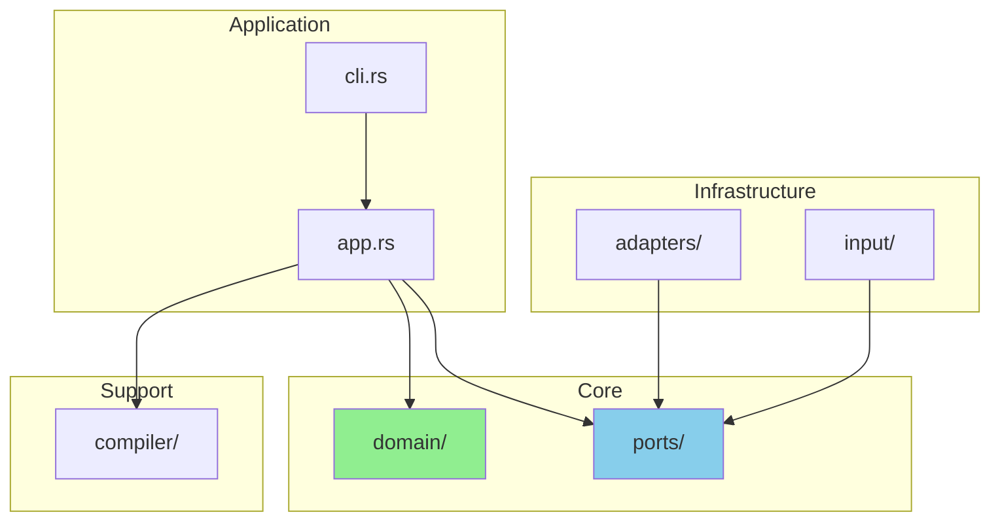

# Development Guide

This guide will help you set up your development environment and contribute to Grit.

## Table of Contents

- [Prerequisites](#prerequisites)
- [Getting Started](#getting-started)
- [Project Structure](#project-structure)
- [Development Workflow](#development-workflow)
- [Testing](#testing)
- [Code Style](#code-style)
- [Documentation](#documentation)
- [Pull Request Process](#pull-request-process)
- [Release Process](#release-process)

## Prerequisites

### Required Tools

```bash
# Rust toolchain (minimum 1.70.0)
curl --proto '=https' --tlsv1.2 -sSf https://sh.rustup.rs | sh

# Git (minimum 2.20.0)
git --version

# Cargo tools
cargo install cargo-watch cargo-audit cargo-tarpaulin
```

### Recommended Tools

```bash
# Development tools
cargo install cargo-edit cargo-outdated

# Code quality
rustup component add clippy rustfmt

# Documentation
cargo install cargo-readme
```

## Getting Started

### 1. Clone the Repository

```bash
git clone https://github.com/tgenericx/commando.git
cd commando
```

### 2. Build the Project

```bash
# Debug build
cargo build

# Release build
cargo build --release
```

### 3. Run Tests

```bash
# All tests
cargo test

# With output
cargo test -- --nocapture

# Specific test
cargo test test_name
```

### 4. Run the Application

```bash
# Run with cargo
cargo run -- [args]

# Install locally
cargo install --path .

# Run installed binary
commando [args]
```

## Project Structure

```
commando/
├── .github/
│   └── workflows/      # CI/CD workflows
├── docs/               # Documentation
│   ├── ARCHITECTURE.md
│   ├── REQUIREMENTS.md
│   ├── FLOW.md
│   └── ...
├── src/
│   ├── adapters/       # Infrastructure adapters
│   ├── compiler/       # DSL compiler
│   ├── domain/         # Business logic
│   ├── input/          # Input strategies
│   ├── ports/          # Interface definitions
│   ├── app.rs          # Application orchestration
│   ├── cli.rs          # CLI parsing
│   └── main.rs         # Entry point
├── tests/              # Integration tests
├── examples/           # Usage examples
├── benches/            # Benchmarks
├── Cargo.toml          # Project configuration
├── Cargo.lock          # Dependency lock file
└── README.md           # Project overview
```

### Module Responsibilities



## Development Workflow

### 1. Create a Feature Branch

```bash
git checkout -b feature/your-feature-name
```

Branch naming conventions:
- `feature/` - New features
- `fix/` - Bug fixes
- `docs/` - Documentation
- `refactor/` - Code refactoring
- `test/` - Test additions

### 2. Make Changes

Follow the [Code Style](#code-style) guidelines.

### 3. Run Pre-commit Checks

```bash
# Format code
cargo fmt

# Run linter
cargo clippy -- -D warnings

# Run tests
cargo test

# Check documentation
cargo doc --no-deps
```

### 4. Commit Changes

```bash
# Use commando itself!
commando

# Or use conventional commits manually
git commit -m "feat(scope): description"
```

### 5. Push Changes

```bash
git push origin feature/your-feature-name
```

### 6. Create Pull Request

Open a PR on GitHub with:
- Clear description
- Link to related issues
- Screenshots (if UI changes)
- Test coverage

## Testing

### Test Organization

```
tests/
├── integration/        # End-to-end tests
│   ├── interactive.rs
│   ├── editor.rs
│   └── direct.rs
├── fixtures/           # Test data
│   ├── templates/
│   └── repos/
└── common/             # Test utilities
    └── mod.rs
```

### Unit Tests

Place unit tests in the same file as the code:

```rust
// src/domain/commit_message.rs

pub struct CommitMessage {
    // ...
}

impl CommitMessage {
    pub fn new(/* ... */) -> Self {
        // ...
    }
}

#[cfg(test)]
mod tests {
    use super::*;
    
    #[test]
    fn test_commit_message_creation() {
        let msg = CommitMessage::new(/* ... */);
        assert_eq!(msg.commit_type(), CommitType::Feat);
    }
    
    #[test]
    fn test_validation() {
        let invalid = CommitMessage::new(/* invalid data */);
        assert!(invalid.validate().is_err());
    }
}
```

### Integration Tests

Place integration tests in `tests/`:

```rust
// tests/integration/commit_workflow.rs

use commando::*;

#[test]
fn test_complete_commit_flow() {
    // Setup test repository
    let temp = setup_test_repo();
    
    // Create and stage file
    create_file(&temp, "test.txt", "content");
    stage_file(&temp, "test.txt");
    
    // Create commit message
    let msg = CommitMessage::builder()
        .commit_type(CommitType::Feat)
        .subject("add test file")
        .build()
        .unwrap();
    
    // Execute commit
    let executor = GitExecutor::open(&temp).unwrap();
    let commit_id = executor.commit(&msg.to_string()).unwrap();
    
    // Verify
    assert!(commit_exists(&temp, commit_id));
}
```

### Test Helpers

```rust
// tests/common/mod.rs

use tempfile::TempDir;
use git2::Repository;

pub fn setup_test_repo() -> TempDir {
    let temp = TempDir::new().unwrap();
    Repository::init(temp.path()).unwrap();
    configure_repo(temp.path());
    temp
}

pub fn create_file(dir: &Path, name: &str, content: &str) {
    let path = dir.join(name);
    std::fs::write(path, content).unwrap();
}

pub fn stage_file(dir: &Path, name: &str) {
    let repo = Repository::open(dir).unwrap();
    let mut index = repo.index().unwrap();
    index.add_path(Path::new(name)).unwrap();
    index.write().unwrap();
}
```

### Running Tests

```bash
# All tests
cargo test

# Unit tests only
cargo test --lib

# Integration tests only
cargo test --test '*'

# Specific module
cargo test domain::

# With logging
RUST_LOG=debug cargo test

# Single-threaded (for debugging)
cargo test -- --test-threads=1
```

### Coverage

```bash
# Generate coverage report
cargo tarpaulin --out Html --output-dir coverage

# View report
open coverage/index.html
```

Target: **80%+ code coverage**

## Code Style

### Formatting

Use `rustfmt` with default settings:

```bash
cargo fmt
```

Configuration in `rustfmt.toml`:

```toml
max_width = 100
hard_tabs = false
tab_spaces = 4
```

### Linting

Use `clippy` with strict settings:

```bash
cargo clippy -- -D warnings
```

Common lints to follow:
- No `unwrap()` in production code
- Prefer `?` operator for error propagation
- Use descriptive variable names
- Keep functions small (< 50 lines)
- Maximum cyclomatic complexity: 10

### Naming Conventions

```rust
// Types: PascalCase
pub struct CommitMessage { }
pub enum CommitType { }
pub trait Executor { }

// Functions and methods: snake_case
pub fn create_commit() { }
pub fn has_staged_changes(&self) -> bool { }

// Constants: SCREAMING_SNAKE_CASE
pub const MAX_SUBJECT_LENGTH: usize = 50;

// Modules: snake_case
mod commit_message;
```

### Documentation Comments

```rust
/// Creates a new commit message.
///
/// # Arguments
///
/// * `commit_type` - The type of commit (feat, fix, etc.)
/// * `subject` - A brief description (max 50 chars)
///
/// # Returns
///
/// A `Result` containing the `CommitMessage` or an error
///
/// # Examples
///
/// ```
/// let msg = CommitMessage::new(CommitType::Feat, "add feature")?;
/// assert_eq!(msg.commit_type(), CommitType::Feat);
/// ```
///
/// # Errors
///
/// Returns an error if the subject is empty or too long.
pub fn new(commit_type: CommitType, subject: String) -> Result<Self> {
    // Implementation
}
```

### Error Handling

```rust
// Use thiserror for custom errors
#[derive(Debug, thiserror::Error)]
pub enum DomainError {
    #[error("Invalid commit type: {0}")]
    InvalidCommitType(String),
    
    #[error("Subject too long: {length} chars (max {max})")]
    SubjectTooLong { length: usize, max: usize },
}

// Use ? operator for propagation
pub fn validate(&self) -> Result<()> {
    if self.subject.is_empty() {
        return Err(DomainError::EmptySubject);
    }
    
    if self.subject.len() > MAX_LENGTH {
        return Err(DomainError::SubjectTooLong {
            length: self.subject.len(),
            max: MAX_LENGTH,
        });
    }
    
    Ok(())
}

// Provide context with anyhow
use anyhow::Context;

pub fn read_config() -> Result<Config> {
    let content = std::fs::read_to_string("config.toml")
        .context("Failed to read config file")?;
    
    toml::from_str(&content)
        .context("Failed to parse config file")
}
```

### Architecture Guidelines

**Follow Hexagonal Architecture:**

```rust
// ✅ Good - Domain doesn't depend on infrastructure
pub struct CommitMessage {
    // Only domain types
}

// ❌ Bad - Domain depends on git2
pub struct CommitMessage {
    git_commit: git2::Commit, // NO!
}

// ✅ Good - Use ports for external dependencies
pub struct App<E: Executor> {
    executor: E,
}

// ❌ Bad - Direct dependency on adapter
pub struct App {
    executor: GitExecutor, // Should be trait
}
```

## Documentation

### Types of Documentation

1. **Code Comments**: Explain complex logic
2. **Doc Comments**: Public API documentation
3. **README Files**: Module-level guides
4. **Architecture Docs**: High-level design
5. **Examples**: Usage demonstrations

### Generating Documentation

```bash
# Generate API docs
cargo doc --no-deps --open

# Generate README from doc comments
cargo readme > README.md
```

### Documentation Checklist

- [ ] All public items have doc comments
- [ ] Complex algorithms explained
- [ ] Examples provided for public APIs
- [ ] README updated for new features
- [ ] Architecture docs updated if needed

## Pull Request Process

### Before Submitting

```bash
# Checklist
cargo fmt              # Format code
cargo clippy           # Check lints
cargo test             # Run tests
cargo doc              # Check docs
git push               # Push changes
```

### PR Template

```markdown
## Description
Brief description of changes

## Type of Change
- [ ] Bug fix
- [ ] New feature
- [ ] Breaking change
- [ ] Documentation update

## Testing
How was this tested?

## Checklist
- [ ] Code follows style guidelines
- [ ] Self-review completed
- [ ] Comments added for complex code
- [ ] Documentation updated
- [ ] Tests added/updated
- [ ] All tests pass
```

### Review Process

1. **Automated Checks**: CI must pass
2. **Code Review**: At least one approval
3. **Testing**: Reviewer tests locally
4. **Documentation**: Verify docs updated
5. **Merge**: Squash and merge

## Release Process

### Versioning

We follow [Semantic Versioning](https://semver.org/):

- **MAJOR**: Breaking changes
- **MINOR**: New features (backward compatible)
- **PATCH**: Bug fixes

### Release Checklist

1. **Update Version**
   ```bash
   # Update Cargo.toml
   version = "1.2.3"
   
   # Update Cargo.lock
   cargo build
   ```

2. **Update Changelog**
   ```markdown
   ## [1.2.3] - 2025-02-15
   
   ### Added
   - New feature X
   
   ### Fixed
   - Bug Y
   
   ### Changed
   - Improved Z
   ```

3. **Create Tag**
   ```bash
   git tag -a v1.2.3 -m "Release v1.2.3"
   git push origin v1.2.3
   ```

4. **Build Release**
   ```bash
   # Build for all platforms
   cargo build --release --target x86_64-unknown-linux-gnu
   cargo build --release --target x86_64-apple-darwin
   cargo build --release --target x86_64-pc-windows-gnu
   ```

5. **Publish**
   ```bash
   # Publish to crates.io
   cargo publish
   
   # Create GitHub release
   # Upload binaries
   ```

## Debugging

### Enable Logging

```bash
# Set log level
RUST_LOG=debug cargo run

# Specific module
RUST_LOG=commando::compiler=trace cargo run

# Multiple modules
RUST_LOG=commando=debug,git2=info cargo run
```

### Use Debugger

```bash
# Install lldb/gdb
rust-lldb target/debug/commando
rust-gdb target/debug/commando
```

### Common Issues

**Issue**: Tests fail randomly
```bash
# Solution: Run single-threaded
cargo test -- --test-threads=1
```

**Issue**: Clippy warnings
```bash
# Solution: Auto-fix
cargo clippy --fix
```

**Issue**: Outdated dependencies
```bash
# Solution: Update
cargo update
cargo outdated
```

## Continuous Integration

### GitHub Actions

```yaml
# .github/workflows/ci.yaml
name: CI

on: [push, pull_request]

jobs:
  test:
    runs-on: ubuntu-latest
    steps:
      - uses: actions/checkout@v3
      - uses: actions-rs/toolchain@v1
      - run: cargo test
      - run: cargo clippy -- -D warnings
      - run: cargo fmt -- --check
```

### Pre-commit Hook

```bash
# .git/hooks/pre-commit
#!/bin/sh
cargo fmt -- --check
cargo clippy -- -D warnings
cargo test
```

## Resources

### Rust Learning
- [The Rust Book](https://doc.rust-lang.org/book/)
- [Rust by Example](https://doc.rust-lang.org/rust-by-example/)
- [Rustlings](https://github.com/rust-lang/rustlings)

### Architecture
- [Hexagonal Architecture](https://alistair.cockburn.us/hexagonal-architecture/)
- [Domain-Driven Design](https://www.domainlanguage.com/ddd/)
- [Clean Architecture](https://blog.cleancoder.com/uncle-bob/2012/08/13/the-clean-architecture.html)

### Git
- [Conventional Commits](https://www.conventionalcommits.org/)
- [Git Documentation](https://git-scm.com/doc)

## Getting Help

- **Issues**: Open an issue on GitHub
- **Discussions**: Use GitHub Discussions
- **Chat**: Join our Discord server
- **Email**: Contact maintainers

---

Happy coding! 🎉

