# Flow Diagrams

This document contains detailed flow diagrams showing the processes and state transitions within Commando.

## Table of Contents

- [Application Flow](#application-flow)
- [Input Mode Flows](#input-mode-flows)
- [Git Operations Flow](#git-operations-flow)
- [Compilation Flow](#compilation-flow)
- [State Machines](#state-machines)
- [Error Handling Flow](#error-handling-flow)

## Application Flow

### Main Application Flow

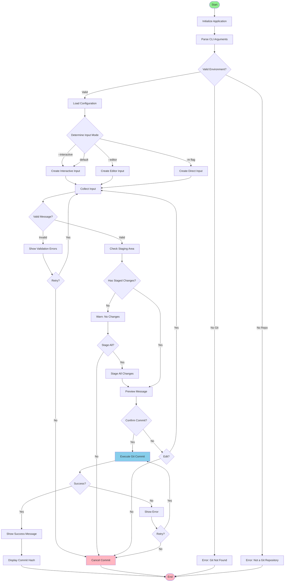

## Input Mode Flows

### Interactive Mode Flow

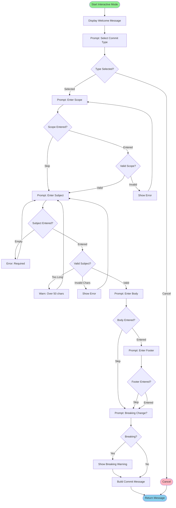

### Interactive Mode Sections

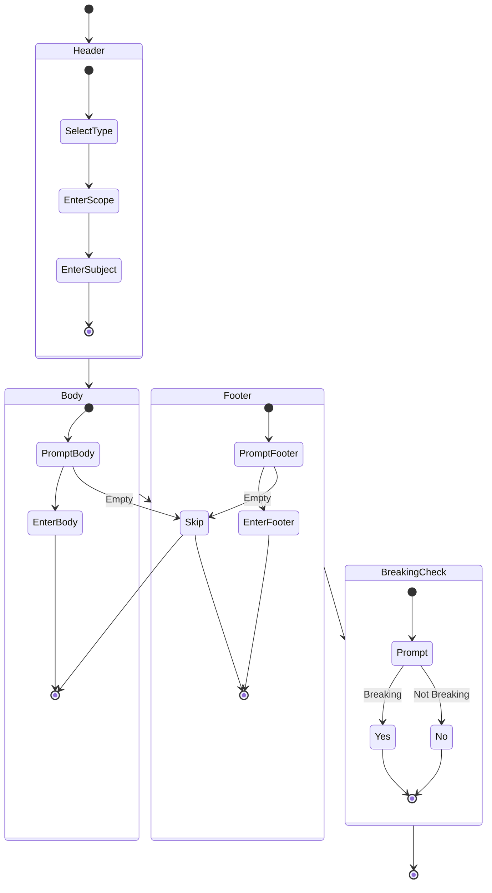

### Editor Mode Flow

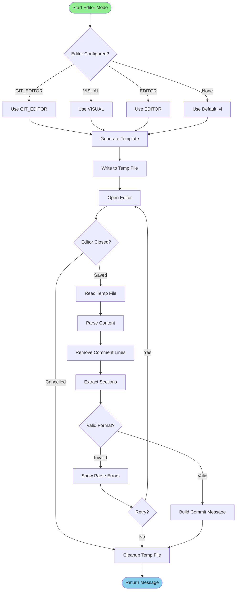

### Editor Template Structure

```
# Type your commit message here
# Lines starting with '#' will be ignored
#
# Format: <type>(<scope>): <subject>
#
# Example: feat(api): add user authentication
#
# Commit types:
#   feat:     A new feature
#   fix:      A bug fix
#   docs:     Documentation changes
#   style:    Code style changes
#   refactor: Code refactoring
#   perf:     Performance improvements
#   test:     Test changes
#   build:    Build system changes
#   ci:       CI configuration changes
#   chore:    Other changes
#   revert:   Revert previous commit

# Subject line (required, max 50 chars):


# Body (optional, explain what and why):


# Footer (optional, reference issues):


# Breaking change? (yes/no):

```

### Direct Mode Flow

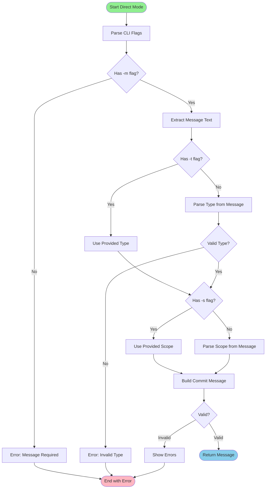

## Git Operations Flow

### Staging Check Flow

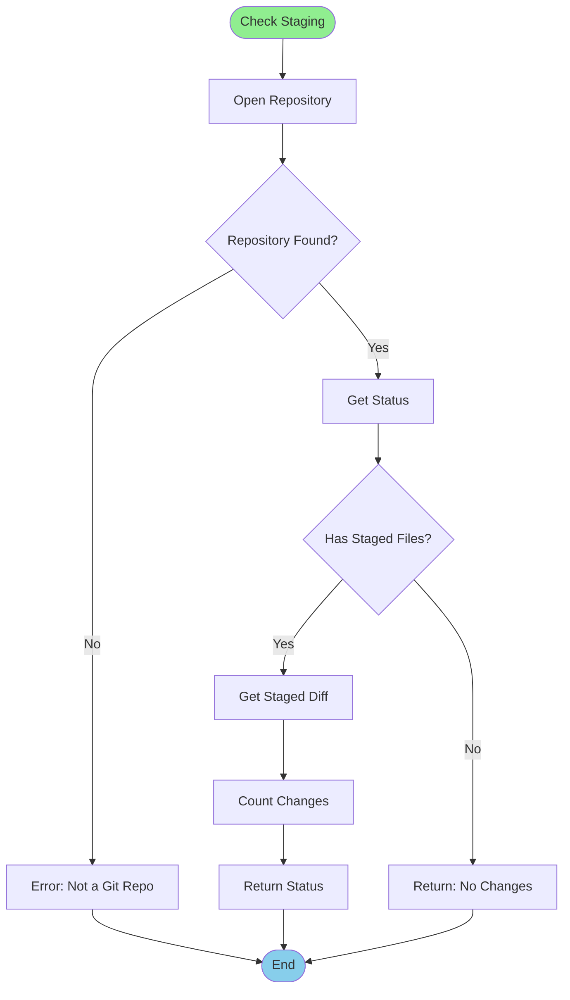

### Commit Execution Flow

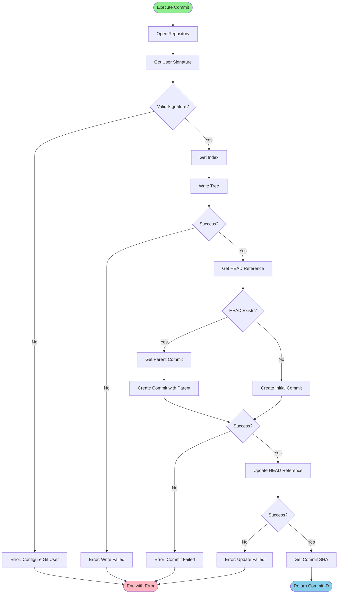

## Compilation Flow

### DSL Compilation Pipeline

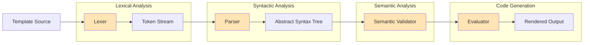

### Lexer State Machine

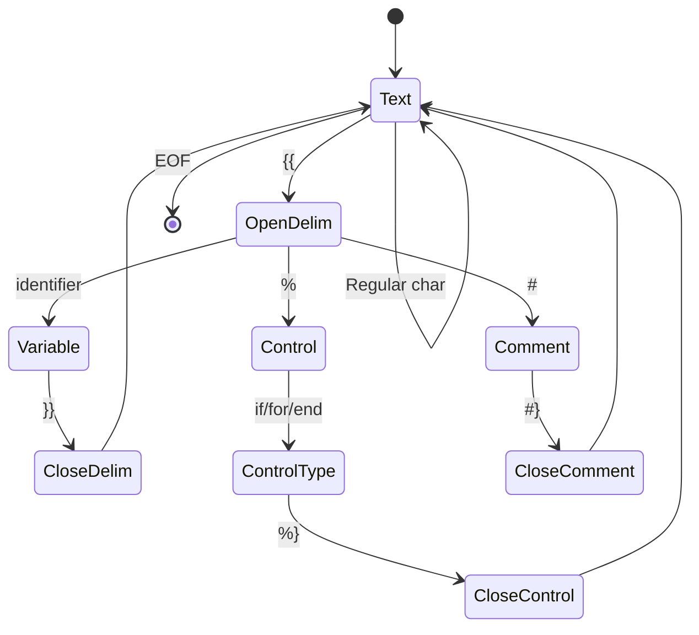

### Parser Flow

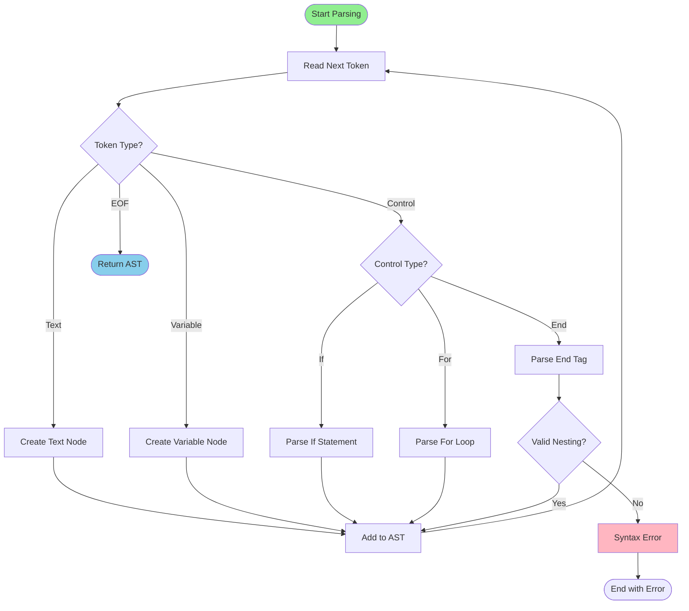

## State Machines

### Application State Machine

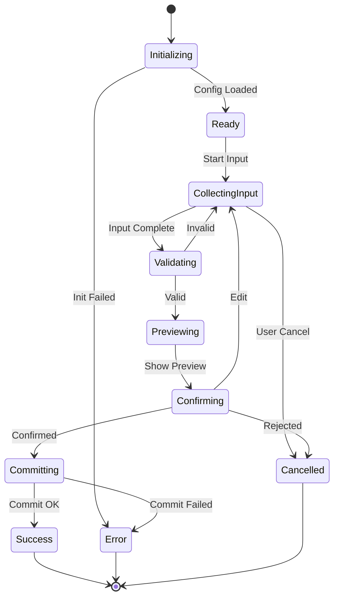

### Input Collection State Machine

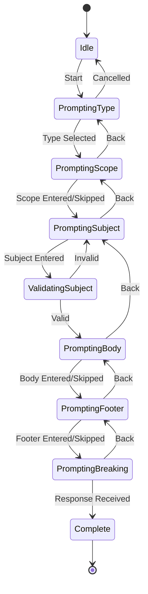

## Error Handling Flow

### Error Propagation

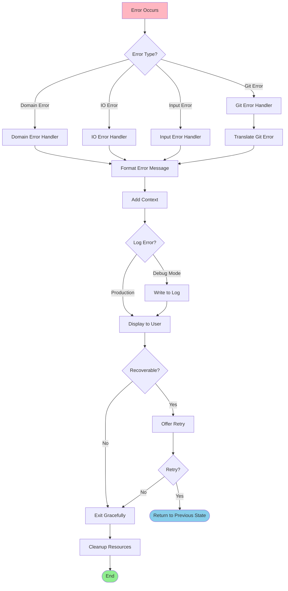

### Error Recovery Strategy

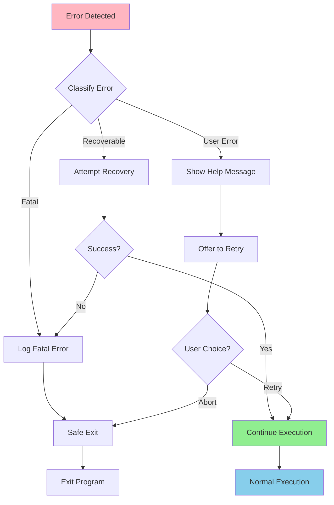

## Sequence Diagrams

### Complete Commit Sequence

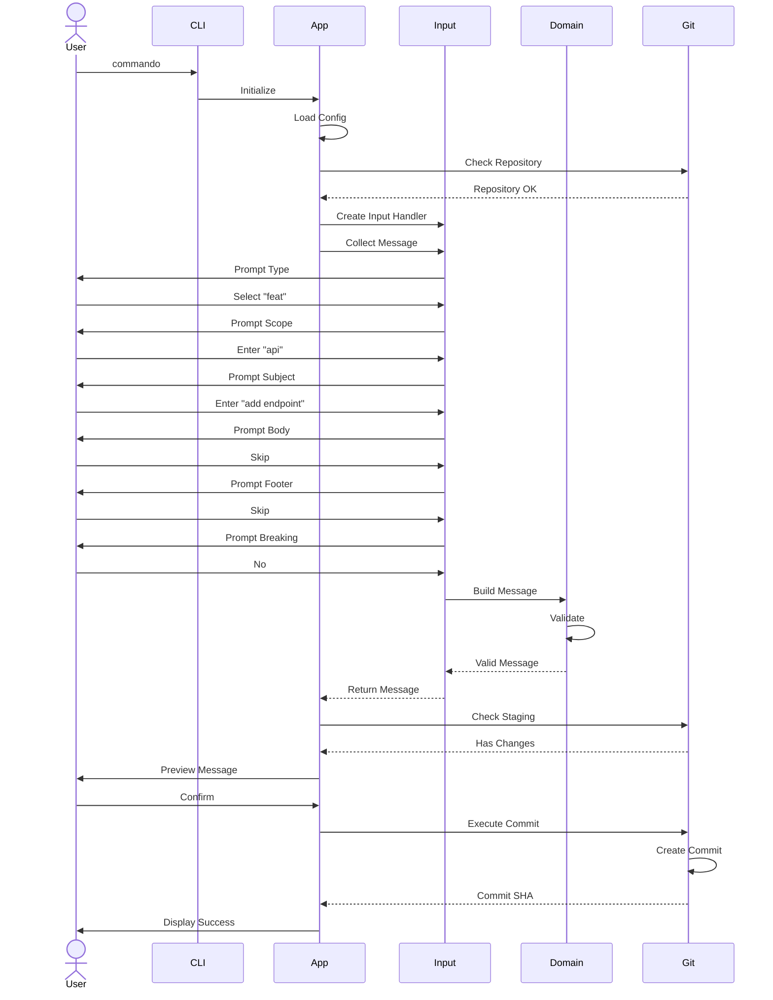

---

For more details, see:
- [Architecture](ARCHITECTURE.md)
- [Requirements](REQUIREMENTS.md)
- [Development Guide](DEVELOPMENT.md)

