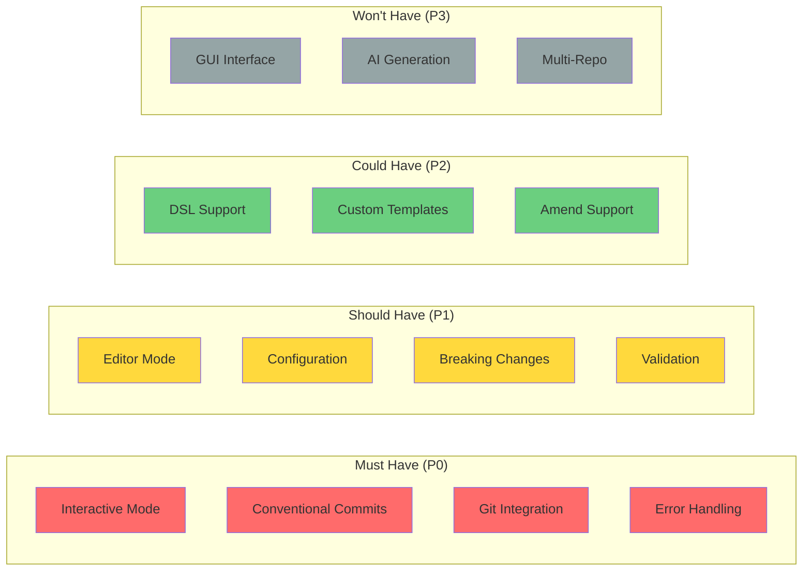

# Requirements Specification

This document outlines the functional and non-functional requirements for the Commando project.

## Table of Contents

- [Functional Requirements](#functional-requirements)
- [Non-Functional Requirements](#non-functional-requirements)
- [User Stories](#user-stories)
- [Constraints](#constraints)
- [Assumptions](#assumptions)

## Functional Requirements

### FR1: Commit Message Creation

#### FR1.1: Interactive Mode
**Priority**: High  
**Description**: Users must be able to create commit messages through an interactive, guided process.

**Acceptance Criteria**:
- System prompts for commit type selection
- System prompts for optional scope
- System prompts for subject line
- System prompts for optional body
- System prompts for optional footer
- System validates each input before proceeding
- User can navigate back to previous prompts
- System displays preview before committing

#### FR1.2: Editor Mode
**Priority**: High  
**Description**: Users must be able to create commit messages using their preferred text editor.

**Acceptance Criteria**:
- System detects user's configured Git editor
- System opens editor with pre-filled template
- Template includes comments explaining each section
- System parses editor content after save
- System validates parsed content
- Invalid content shows helpful error messages

#### FR1.3: Direct Mode
**Priority**: Medium  
**Description**: Users must be able to create commit messages directly from command line arguments.

**Acceptance Criteria**:
- System accepts `-m` flag for message
- System accepts `-t` flag for type
- System accepts `-s` flag for scope
- Message follows Conventional Commits format
- System validates provided arguments
- Quick commits without interactive prompts

### FR2: Conventional Commits Support

#### FR2.1: Commit Types
**Priority**: High  
**Description**: System must support all standard Conventional Commit types.

**Supported Types**:
- `feat` - New features
- `fix` - Bug fixes
- `docs` - Documentation changes
- `style` - Formatting changes
- `refactor` - Code restructuring
- `perf` - Performance improvements
- `test` - Test additions/changes
- `build` - Build system changes
- `ci` - CI configuration changes
- `chore` - Maintenance tasks
- `revert` - Revert previous commits

**Acceptance Criteria**:
- All types are available in selection
- Each type has clear description
- Invalid types are rejected
- Case-insensitive type matching

#### FR2.2: Message Format
**Priority**: High  
**Description**: System must generate properly formatted Conventional Commit messages.

**Format**:
```
<type>(<scope>): <subject>

<body>

<footer>
```

**Acceptance Criteria**:
- Type is always present and lowercase
- Scope is optional and in parentheses
- Subject is present and starts with lowercase
- Subject is under 50 characters (warning if longer)
- Body is optional and separated by blank line
- Footer is optional and separated by blank line
- Breaking changes indicated by "!" or footer

#### FR2.3: Breaking Changes
**Priority**: Medium  
**Description**: System must support marking breaking changes.

**Acceptance Criteria**:
- User can mark commit as breaking change
- Breaking changes shown with "!" in header
- Breaking changes documented in footer
- Clear warning displayed for breaking changes

### FR3: Git Integration

#### FR3.1: Staging Area Check
**Priority**: High  
**Description**: System must verify staged changes before committing.

**Acceptance Criteria**:
- System checks for staged files
- Warning displayed if no staged changes
- User can choose to stage all changes
- User can cancel if no changes staged
- System shows diff summary

#### FR3.2: Commit Execution
**Priority**: High  
**Description**: System must execute Git commits reliably.

**Acceptance Criteria**:
- Commit created with user-provided message
- Commit includes all staged changes
- System reports success/failure
- Failed commits show error details
- Support for `--amend` flag

#### FR3.3: Repository Detection
**Priority**: High  
**Description**: System must detect if running in a Git repository.

**Acceptance Criteria**:
- Checks for .git directory
- Walks up directory tree if needed
- Clear error if not in repository
- Suggests `git init` if applicable

### FR4: DSL (Domain-Specific Language)

#### FR4.1: Template Syntax
**Priority**: Low  
**Description**: System supports custom template syntax for commit messages.

**Features**:
- Variable substitution: `{{variable}}`
- Conditional sections: ``
- Loops: ``
- Comments: `{# comment #}`

**Acceptance Criteria**:
- Templates parsed correctly
- Syntax errors reported with line numbers
- Variables replaced with actual values
- Conditionals evaluated properly

#### FR4.2: Template Loading
**Priority**: Low  
**Description**: Users can provide custom templates.

**Acceptance Criteria**:
- Templates loaded from config file
- Templates loaded from file path
- Default template always available
- Template syntax validated on load

### FR5: User Interface

#### FR5.1: Terminal Output
**Priority**: High  
**Description**: System provides clear, readable terminal output.

**Acceptance Criteria**:
- Colored output for different message types
- Progress indicators for long operations
- Clear error messages with context
- Success messages with commit hash
- Proper Unicode support

#### FR5.2: Input Validation
**Priority**: High  
**Description**: System validates all user input.

**Acceptance Criteria**:
- Subject line length validation
- Empty input detection
- Invalid characters detected
- Helpful error messages
- Suggestions for corrections

#### FR5.3: Confirmation Prompts
**Priority**: Medium  
**Description**: System shows confirmation before committing.

**Acceptance Criteria**:
- Preview shows complete message
- User can confirm or cancel
- Option to edit after preview
- Default to safe action (cancel)

### FR6: Configuration

#### FR6.1: Configuration File
**Priority**: Medium  
**Description**: Users can configure behavior via config file.

**Configurable Options**:
- Default commit type
- Custom commit types
- Editor preference
- Template location
- Output format
- Validation rules

**Acceptance Criteria**:
- Config file in standard location
- TOML format for config
- Validates on load
- Helpful error for invalid config
- Merges with defaults

#### FR6.2: CLI Overrides
**Priority**: Medium  
**Description**: CLI flags override configuration.

**Acceptance Criteria**:
- Flags take precedence over config
- Flags take precedence over environment
- Clear priority order documented

## Non-Functional Requirements

### NFR1: Performance

#### NFR1.1: Startup Time
**Priority**: High  
**Constraint**: Application must start in under 100ms on modern hardware.

**Rationale**: Developers use commit tools frequently; slow startup is frustrating.

**Measurement**: Time from invocation to first prompt.

#### NFR1.2: Response Time
**Priority**: High  
**Constraint**: All operations must complete in under 1 second.

**Rationale**: Interactive tools need immediate feedback.

**Measurement**: Time from user input to system response.

### NFR2: Reliability

#### NFR2.1: Error Handling
**Priority**: High  
**Constraint**: All errors must be caught and handled gracefully.

**Acceptance Criteria**:
- No panic!() in production code
- All Results and Options handled
- Meaningful error messages
- Recovery suggestions provided

#### NFR2.2: Data Integrity
**Priority**: High  
**Constraint**: Never corrupt Git repository.

**Acceptance Criteria**:
- Use Git's atomic commit operations
- Validate before any Git operation
- Don't modify working directory
- Don't modify untracked files

### NFR3: Usability

#### NFR3.1: Learning Curve
**Priority**: High  
**Constraint**: New users should be productive within 5 minutes.

**Acceptance Criteria**:
- Help text easily accessible
- Examples in help output
- Interactive mode self-explanatory
- Good defaults for all options

#### NFR3.2: Accessibility
**Priority**: Medium  
**Constraint**: Tool should work with screen readers.

**Acceptance Criteria**:
- No essential information conveyed only by color
- Clear text descriptions
- Keyboard navigation only (no mouse required)

### NFR4: Portability

#### NFR4.1: Cross-Platform
**Priority**: High  
**Constraint**: Must run on Linux, macOS, and Windows.

**Acceptance Criteria**:
- Single binary for each platform
- No platform-specific behavior
- Path handling is cross-platform
- Tests pass on all platforms

#### NFR4.2: Git Version Support
**Priority**: Medium  
**Constraint**: Support Git 2.20.0 and newer.

**Rationale**: Git 2.20.0 released Dec 2018; reasonable minimum version.

### NFR5: Maintainability

#### NFR5.1: Code Quality
**Priority**: High  
**Standards**:
- Clippy lints pass with no warnings
- rustfmt formatting enforced
- All public APIs documented
- Code coverage above 80%

#### NFR5.2: Architecture
**Priority**: High  
**Standards**:
- Follow hexagonal architecture
- Clear separation of concerns
- Dependency injection for testability
- No circular dependencies

### NFR6: Security

#### NFR6.1: Input Sanitization
**Priority**: High  
**Constraint**: All user input must be sanitized.

**Acceptance Criteria**:
- No command injection possible
- No path traversal possible
- Shell metacharacters escaped
- Input length limits enforced

#### NFR6.2: Safe Dependencies
**Priority**: High  
**Constraint**: Use only well-maintained dependencies.

**Acceptance Criteria**:
- No known CVEs in dependencies
- Regular dependency audits
- Minimal dependency tree
- All dependencies actively maintained

## User Stories

### Story 1: Quick Feature Commit
**As a** developer  
**I want to** quickly commit a new feature  
**So that** I can maintain a clean Git history without interrupting my flow

**Acceptance Criteria**:
- Can commit in under 30 seconds
- Conventional format automatically applied
- Don't need to remember format rules

### Story 2: Detailed Bug Fix
**As a** developer  
**I want to** write a detailed explanation for a bug fix  
**So that** team members understand the context

**Acceptance Criteria**:
- Can provide multi-line body
- Can reference issue numbers in footer
- Preview before committing

### Story 3: Team Consistency
**As a** team lead  
**I want** all team members to use consistent commit messages  
**So that** we can automatically generate changelogs

**Acceptance Criteria**:
- Tool enforces format standards
- Custom types can be added
- Configuration shared across team

### Story 4: Learning Best Practices
**As a** junior developer  
**I want** guidance on writing good commit messages  
**So that** I can follow project conventions

**Acceptance Criteria**:
- Interactive prompts explain each section
- Examples provided in help text
- Validation prevents common mistakes

### Story 5: Breaking Changes
**As a** maintainer  
**I want to** clearly mark breaking changes  
**So that** users know to check release notes

**Acceptance Criteria**:
- Easy to mark commits as breaking
- Breaking changes clearly highlighted
- Can be filtered in changelog generation

## Constraints

### Technical Constraints

1. **Rust Version**: Minimum Rust 1.70.0
2. **Git Requirement**: Git must be installed and in PATH
3. **Terminal**: Requires terminal with ANSI color support
4. **File System**: Requires read/write access to .git directory

### Business Constraints

1. **License**: Must be compatible with project license
2. **No Network**: Tool works completely offline
3. **Privacy**: No data collected or transmitted

### Resource Constraints

1. **Binary Size**: Target under 10MB for release binary
2. **Memory**: Run with under 50MB RSS
3. **Dependencies**: Minimize dependency count

## Assumptions

### User Assumptions

1. User has basic Git knowledge
2. User works in terminal environment
3. User understands commit message importance
4. User's terminal supports UTF-8

### Technical Assumptions

1. Git repository is not corrupted
2. User has write permissions
3. File system is case-sensitive (or handled)
4. System clock is reasonably accurate

### Environment Assumptions

1. Running on Unix-like system or Windows
2. Standard shell environment variables set
3. Locale configuration is reasonable
4. Sufficient disk space for Git operations

## Out of Scope

The following are explicitly NOT requirements:

1. **Commit History Editing**: Use `git rebase`
2. **Branch Management**: Use git directly
3. **Push/Pull Operations**: Use git directly  
4. **Merge Conflict Resolution**: Use git directly
5. **Repository Creation**: Use `git init`
6. **GUI Interface**: Terminal only
7. **Integration with Git Hosts**: GitHub, GitLab, etc.
8. **Automatic Commit Message Generation**: AI-based tools
9. **Multi-Repository Support**: One repo at a time
10. **Localization**: English only initially

## Priority Matrix



## Validation Criteria

### Definition of Done

A requirement is considered complete when:

1. **Implemented**: Code written and reviewed
2. **Tested**: Unit and integration tests pass
3. **Documented**: User and API docs updated
4. **Verified**: Acceptance criteria met
5. **Released**: Available in tagged release

### Acceptance Testing

Each requirement will be validated through:

1. **Unit Tests**: Component-level correctness
2. **Integration Tests**: End-to-end workflows
3. **Manual Testing**: Real-world usage
4. **User Feedback**: Alpha/beta testing

---

For implementation details, see:
- [Architecture](ARCHITECTURE.md)
- [Flow Diagrams](FLOW.md)
- [Development Guide](DEVELOPMENT.md)

